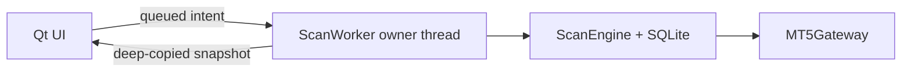

# Final end-to-end audit — PR 6

Date: 2026-08-15
Scope: `desktop/` application, branch `claude/alikhande-scanner-redesign-ty2j6z`
Local source status: `STATIC_CANDIDATE`
Acceptance status: `BLOCKED` pending Windows + a real MetaTrader 5 terminal

This is the adversarial audit of the application path the operator actually
uses. It does not qualify the separate `MQL5/` EA tree and it does not claim
strategy edge.

## Runtime ownership



- `MainWindow` receives a `ScanWorker` built only from `WorkerBootstrap`
  descriptions. It never receives a gateway, engine, repository or open
  database connection.
- `ScanWorker._build_engine()` constructs MT5, SQLite and `ScanEngine` after the
  worker thread starts. MT5 connect, reconnect, reads, send and shutdown remain
  on that same owner thread. The adapter rejects cross-thread calls itself.
- UI actions are queue messages. One action is handled only after a fresh scan
  pass and another pass is run before publishing the resulting snapshot.
- Snapshots are deep copies; mutable engine objects do not cross into Qt.
- Positions and orders are read once into the Worker-owned pass model. Failed
  reads carry explicit `positions_known=false` / `orders_known=false`, halt
  arming, and render as unknown in Risk/Execution; an empty list is displayed
  only after an authoritative empty broker response.
- The in-window backtest has its own worker and `OfflineGateway`; it has no MT5
  or live `ScanEngine` handle.
- Worker shutdown is latched by a thread-safe event. A close requested just
  before `QThread` enters `run()` cannot be overwritten by startup and leave
  the broker/state owner alive after the UI attempted to join it.
- `python -m alikhande doctor` is the intentional exception: it is a separate,
  single-threaded diagnostic process, not a GUI path. It opens and closes MT5
  on its own calling thread.
- A reconnect refreshes unresolved symbol mappings, specifications, exposure
  state and a previously unavailable risk baseline on that same Worker thread;
  repairing IPC can no longer leave startup-time `SYMBOL_NOT_FOUND` state
  frozen for the rest of the process.

Static AST checks and integration tests enforce this boundary. A restore also
refuses to swap the database unless the state-owner worker has actually joined.

## Broker truth and attribution

No state is reconstructed from `magic + symbol` or from price proximity.

1. A unique broker-visible `AK-<16 hex>` correlation key is generated and the
   execution intent is committed before the sole `send_order` call.
2. Reconciliation accepts only an exact request/order/deal ticket, position id,
   or exact correlation comment. The account history is intentionally fetched
   without a magic pre-filter because manual, SL, TP or broker-generated exit
   deals may not retain the opener's magic; exact identity is applied after the
   read.
3. `None` from MT5 positions/orders/history is an API failure, not an empty
   result. Silence, an unknown retcode, a missing send reply, source conflicts,
   INOUT/reversal, excess entry/exit volume, disagreement between exact source
   position ids, or a netting-position entry with no direct execution link all
   stay non-terminal `UNKNOWN`.
4. A historical fill with neither an exact live position/order nor a complete
   exit becomes `UNKNOWN` after the fixed grace deadline instead of remaining
   stuck forever in FILLED.
5. A same-symbol foreign exposure is refused again at Confirm. This prevents a
   new order from merging into an existing netting position whose later exits
   could not be attributed honestly.
6. Broker deal evidence persists ticket, order, position, broker time, comment,
   reason, volume, price and net P/L. Net P/L includes profit, commission, swap
   and the separate MT5 `fee` field.
7. An order/position id learned from an exact entry Deal is fed into live
   Order/Position reads in the same reconciliation round. This does not depend
   on the broker copying the comment to a Position row. Duplicate history rows
   are reduced by deal ticket, while conflicting duplicate facts, cross-symbol
   exact ids, unsupported deal types and non-positive trade facts become
   `UNKNOWN`.
8. A fully closed *observed partial fill* is not terminal if a failed live
   Position/Order read leaves the unfilled remainder unknown. Only a successful
   empty live read, or exact fills covering the entire request, closes that gap.

TP and SL are assigned only from the broker's close reason. A manual close,
stop-out, mixed reasons or absent reason is recorded as `CLOSED`, not guessed
from price or P/L. Every closing slice must report the same reason: `[unknown,
TP]` is `MIXED`, not TP. Broker history cannot state the tick path, so live
MFE/MAE is stored as SQL `NULL`, not fabricated as zero.

The pure strategy still creates its legacy structural key, but the persisted
signal id is a 64-bit evidence identity scoped by structure, rule/scoring
version, parameter hash and broker-spec hash. A collision is checked against
that complete tuple and fails closed instead of merging two experiments.
Replay adds its UUID run id as another namespace.

## Demo Fill to Outcome and Evidence

The real application lifecycle is now closed as follows:

1. Confirm rechecks calendar coverage, risk state, account, symbol
   specification, all same-symbol exposure, current tick, price drift and
   `OrderCheck`. It also reprices the exact volume from the current request
   price to the stop and refuses if cash risk now exceeds the approved plan.
2. The exact intent and correlation key are durable before send. A thrown or
   non-definitive send result remains `UNKNOWN` and keeps the submit gate shut.
3. Exact entry deals move the signal to `ACTIVE`. Deal tickets are admitted
   once in SQLite before they may affect volume; duplicate delivery and restart
   replay cannot double-count them.
4. Partial exits remain open. Only exact deals proving full entered volume was
   closed make the execution terminal.
5. Exact weighted entry/exit, filled/closed volume, broker close time, net P/L
   and close reason build one insert-only outcome.
6. Outcome, terminal signal state and updated consecutive-loss risk state commit
   in one SQLite transaction. There is no crash window containing only half of
   that fact.
7. Restart recovery closes both important missing-evidence windows:
   completed deals rebuild a missing TP/SL/CLOSED outcome from the persisted
   deal ledger even when MT5 history is temporarily unavailable; a persisted
   rejection/cancellation rebuilds non-scorable `NOT_FILLED` without allowing a
   second submission.

Shadow is also reachable through the real Arm → Confirm UI path. On a real
account it executes the same preflight and returns before the send boundary.
Its outcome is explicitly `source=SHADOW`, `evidence_quality=PREFLIGHT_ONLY`,
`valid_for_statistics=false`; it can never masquerade as Demo broker evidence.
Its mode is explicit execution provenance in schema v4, so crash recovery does
not infer Shadow from a message string.

## Backtest and prior-evidence preservation

Every persistence-capable backtest entrypoint—UI, `backtest`, and `calibrate`—
uses `run_with_atomic_persistence()`:

- the replay writes to a disposable staging SQLite database;
- signal ids are 64-bit namespaced by a UUID run id, run ids are insert-only,
  and any structural identity collision is a hard failure;
- cancellation discards only the new staged run;
- cancellation is polled every replay step (progress rendering remains
  throttled), and a UI view is never discarded while its QThread is still live;
- an exception closes and removes staging without opening the target database;
- only a finished staged run may enter the target transaction;
- target REPLAY rows are deleted and the complete replacement is inserted in
  one `BEGIN IMMEDIATE` transaction;
- an injected copy-time constraint failure rolls the purge back, preserving
  both prior replay evidence and unrelated LIVE evidence;
- statistics exclude unfinished replay runs even for direct library callers.

Therefore the target contains either the previous valid replay evidence or the
entire new run. It never contains a partially published replacement because a
run was cancelled or raised.

## Local evidence

The final evidence commands are:

```text
python tools/static_validate.py
python tools/test_static_gate.py
QT_QPA_PLATFORM=offscreen python -m unittest discover -s desktop/tests
```

The final test count and commit SHA are recorded in the PR handoff after the
last clean-tree run. The tests include adapter execution against `fake_mt5`,
real sqlite3 migration/rollback, worker-boundary AST checks, exact-correlation
adversarial cases, the immediate-start/stop thread race, Demo crash
reconstruction, reachable Shadow, and
cancel/error/copy-failure preservation of old replay evidence.

## Acceptance gates

| Gate | Desktop evidence in this environment | Status |
|---|---|---|
| G0 source integrity | Static validator, single-send check, architecture audit | `STATIC_CANDIDATE` |
| G1–G2 MetaEditor/MQL runtime | Applies to the separate EA and cannot run here | `BLOCKED` |
| G3–G8 logic/persistence/execution/calendar | Executed locally with offline gateway, MT5 double and real sqlite3; real MT5 semantics still pending | `BLOCKED` |
| G9 UI workflow | Headless automated construction only; Windows interaction/screenshots pending | `BLOCKED` |
| G10–G11 Shadow/Demo terminal smoke | Code path executed with doubles; controlled real-terminal run pending | `BLOCKED` |
| G12 historical validity | Synthetic/local mechanics only; no OOS edge evidence | `STRATEGY_EDGE_NOT_PROVEN` |
| G13 adversarial review | This audit plus static searches and regression tests | `STATIC_CANDIDATE` |

## The remaining real unknown

No known source-level defect from this audit is deferred. What remains requires
Windows and MetaQuotes' real package/terminal rather than another local code
review:

- actual MT5 IPC attach/reconnect/shutdown behaviour on the worker thread;
- real field and timing semantics for order/deal/position identifiers, comments,
  fees and close reasons across hedging and netting demo accounts;
- an actual Demo request → order → partial/full fill → position → TP/SL/manual
  close, including restart during an active or uncertain state;
- Python EMA/ATR/ADX parity against MT5 buffers on identical exported bars;
- the PyInstaller build, high-DPI Windows UI and operator workflow;
- a maintained `calendar.csv` whose declared `coverage_until` spans every live
  trading window.

No real-account execution was performed. No profitability or probability claim
is made.
